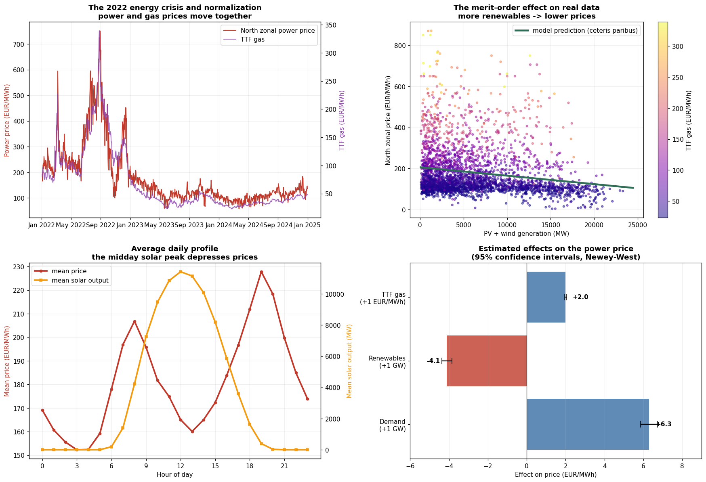

# The Merit-Order Effect in the Italian Electricity Market

**Quantifying how renewable generation lowers day-ahead power prices — North zone, 2022–2024, with the 2022 gas crisis in sample.**



## Research question

Holding demand and fuel costs constant, how much does an additional GW of non-programmable renewable generation (solar PV + wind) lower the zonal day-ahead electricity price?

Renewables bid at near-zero marginal cost, entering the supply curve first and displacing gas-fired plants at the margin — the **merit-order effect**. This project measures it on real Italian market data covering both the 2022 energy crisis and the 2023–24 normalization.

## Key results

OLS with monthly dummies and Newey-West HAC standard errors (lag = 24), 26,250 hourly observations, R² = 0.895:

| Driver | Effect on North zonal price | 95% CI |
|---|---|---|
| Renewables **+1 GW** | **−4.1 EUR/MWh** | [−4.4, −3.8] |
| Gas TTF **+1 EUR/MWh** | **+2.0 EUR/MWh** | [+1.9, +2.0] |
| Demand **+1 GW** | **+6.3 EUR/MWh** | [+5.9, +6.7] |

The gas pass-through of ≈2 is consistent with CCGT plants setting the marginal price at ~50% thermal efficiency.

**The merit-order effect is regime-dependent.** Re-estimating year by year:

| Year | RES effect (EUR/MWh per GW) | Gas pass-through | R² |
|---|---|---|---|
| 2022 (crisis) | **−6.3** | +1.85 | 0.861 |
| 2023 | −3.3 | +1.60 | 0.728 |
| 2024 | −2.5 | +2.29 | 0.717 |

The effect scales with the price of the displaced marginal fuel: when gas traded above 100 EUR/MWh, each renewable MWh displacing a gas plant was worth far more than in normal times.

## Data

| Dataset | Source | Frequency | Notes |
|---|---|---|---|
| Zonal load (North) | [Terna Download Center](https://www.terna.it/en/electric-system/transparency-report/download-center) | 15-min → hourly | `Total Load` |
| RES generation (PV + wind) | Terna Download Center | Hourly | National, `Renewable Generation`, GWh |
| Zonal price (North) | [GME](https://www.mercatoelettrico.org) | Hourly | MGP day-ahead |
| Gas TTF front-month | [Investing.com](https://www.investing.com/commodities/dutch-ttf-gas-c1-futures-historical-data) | Daily → hourly ffill | EUR/MWh |

Raw files are not redistributed here (source licensing); download them from the links above and place them in `data/` with the naming shown in `src/data_loader.py`.

## Method

`price ~ load + renewables + gas + residual_load² + monthly dummies`

- **Monthly dummies** absorb the shared seasonality that would otherwise create spurious correlation (winter = high gas, high load, low solar).
- **Quadratic residual-load term** captures supply-curve convexity (expensive peakers at high residual demand).
- **Newey-West HAC errors (lag 24)** address the strong autocorrelation of hourly prices (raw Durbin-Watson ≈ 0.17); OLS-classic standard errors would overstate precision ~5×.
- **Robustness**: estimates are stable year-by-year in sign and order of magnitude, and unchanged when excluding the 22 system-stress hours (price ≤ 5 EUR/MWh).
- **Geographic robustness**: re-estimating on a fully national specification (PUN price + Italy-wide load + national generation) yields a merit-order effect of **−4.7 EUR/MWh per GW** (vs −4.1 in the North-zone specification) and an identical gas pass-through (**+1.95** vs +1.99). The result does not depend on the zonal-vs-national aggregation choice — which also addresses the zonal-asymmetry caveat directly rather than merely declaring it.

| Specification | Merit-order (per GW) | Gas pass-through | R² |
|---|---|---|---|
| North zone (main) | −4.1 EUR/MWh | +1.99 | 0.895 |
| National (PUN) | −4.7 EUR/MWh | +1.95 | 0.905 |

### Methodological validation on synthetic data

Before touching real data, the full pipeline was validated on a simulated market with a *known* merit-order coefficient hidden in the price equation (`simulation/simulation_validation.py`). The regression recovers the true parameters exactly once the price-floor distortion is handled — evidence that the estimation logic is sound. This simulate-first workflow also surfaced an omitted-variable bias (gas) and a seasonality confound before they could contaminate the real-data analysis.

## Repository structure

```
├── README.md
├── requirements.txt
├── data/                      # place downloaded source files here (not tracked)
├── src/
│   ├── data_loader.py         # reads, cleans, aligns all sources to hourly grid
│   ├── analysis.py            # main regression + yearly stability + robustness
│   └── plots.py               # generates figures/results.png
├── simulation/
│   └── simulation_validation.py   # pipeline validation on synthetic data
└── figures/
    └── results.png
```

## Reproducing

```bash
pip install -r requirements.txt
# download source files into data/ (see Data section)
python src/analysis.py     # estimates and robustness checks
python src/plots.py        # generates figures/results.png
```

## Limitations and future work

This is a deliberately transparent baseline, not a structural model:

1. **Association, not identification.** OLS with controls measures a conditional association. Causal identification would require instruments (e.g., wind speed as an IV for renewable output).
2. **Linear specification.** Power prices have fat tails and scarcity spikes (kurtosis ≈ 11 in residuals); quantile regression or regime-switching models would capture the extremes.
3. **Zonal asymmetry.** In the main specification price and load are North-zone, while RES generation is national — Terna publishes hourly generation by source only at national level (zonal disaggregation exists for *installed capacity*, not for *hourly actual generation*). Since Northern Italy concentrates the largest share of national PV capacity (Lombardy and Veneto rank first and second), national generation is a reasonable first-order proxy. **This choice is validated by the national robustness check below**, where all variables share the same (national) geographic level and the merit-order effect is confirmed.
4. **PV curtailment** is not observable in actual-generation data; a proxy check (excluding stress hours) suggests limited impact in this sample.
5. **Cross-zonal flows** and interconnector imports are omitted; a panel across all seven bidding zones is the natural extension.

## Author

Manuel Giannetti — energy markets & geopolitics analyst. Writing on energy security at [IARI](https://iari.site).

*Data sources: Terna S.p.A., GME S.p.A., ICE Endex via Investing.com. All data publicly available.*
